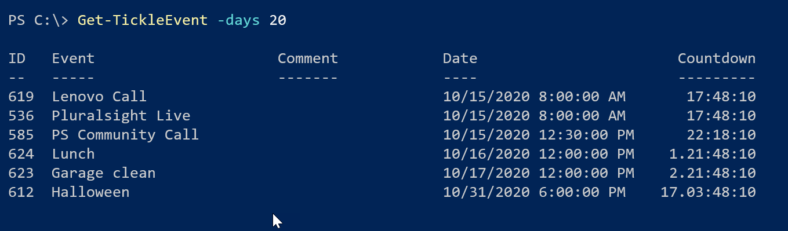

# MyTickle

 


This PowerShell module is designed as a tickle or reminder system. You can add and edit reminders of upcoming events. Use the module commands to display upcoming events. If you are interested, the core object of the module is built with a PowerShell class.

Install the latest version from the PowerShell Gallery.

```PowerShell
Install-Module MyTickle [-scope currentuser]
```

## Setup

This module requires a SQL Server installation but, it should work cross-platform and in PowerShell 7.x. You can read the about help topic for more information.

```powershell
Help about_mytickle
```

The module stores event information in a SQL Server database. Ideally, you will be running a version of SQL Server Express on your desktop. Use the `Initialize-TickleDatabase` command to create the database and table. It is possible to store the database on a remote server, but that has not been fully tested. The module includes T-SQL files you can give to a database administrator to run and create the database for you. The default database size is 100MB, which should be more than enough space.

Once you've been using the database, use `Get-TickleDBInformation` to view usage.

```PowerShell
PS C:\> Get-TickleDBInformation

Name           : TickleEventDB
Path           : C:\Program Files\Microsoft SQL Server\MSSQL15.SQLEXPRESS\MSSQL\DATA\TickleEventDB.mdf
SizeMB         : 100
UsedMB         : 3.375
AvailableMB    : 96.625
LastFullbackup : 12/11/2020 9:00:07 PM
```

The module uses a set of global variables to define the SQL connection. The default installation assumes a local SQL Server Express instance.

```PowerShell
PS C:\> Get-Variable Tickle*

Name                           Value
----                           -----
TickleDB                       TickleEventDB
TickleDefaultDays              7
TickleServerInstance           .\SqlExpress
TickleTable                    EventData
```

If you use a remote server or some other named instance, you will need to change the value of `$TickleServerInstance` after you import the module. This step is something you would most likely do in your PowerShell profile script.

```PowerShell
$TickleServerInstance = 'chi-sql01'
```

The module should work cross-platform, even on Linux. Although in that situation, you will need to specify a username and password. It is also assumed that the SQL Server is configured to use both SQL and Windows authentication.

## Add Events

Adding a new event is very simple.

```PowerShell
Add-TickleEvent -event "company picnic" -date "7/1/2021 12:00PM"
```

## Get Events

Once initialized and with entries added, you can view upcoming events.



Starting with version 3.3.0, if you are running `Get-TickleEvent` in a console or VSCode host, events happening in less than 1 day will be displayed in red using ANSI escape sequences. Events in less than 2 days will be displayed in yellow.

As an alternative, the `myTickle` object has a format view definition file with an alternate view.

```PowerShell
Get-TickleEvent -days 60 | Format-Table -view date
```

## Show Events

The module has a command to display upcoming events in a color-coded format using ANSI escape sequences. The default is events in the next seven days, but you can specify a different value.


- Events due in the next twenty-four hours will be displayed in red.
- Events due in forty-eight hours or less will be shown in yellow.

For more information, please read the [About](docs/about_MyTickle.md) help topic.

## Related Modules

You might also be interested in these PowerShell modules:

- Manage tasks and To-Do items with the [MyTasks](https://github.com/jdhitsolutions/MyTasks) module.
- Display a calendar in the PowerShell console with the [PSCalendar](https://github.com/jdhitsolutions/PSCalendar) module.

